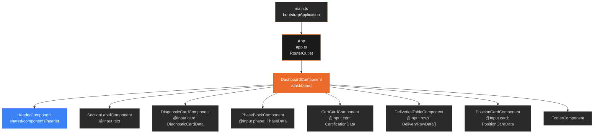
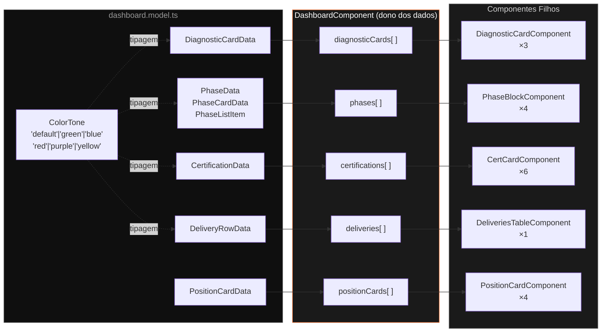
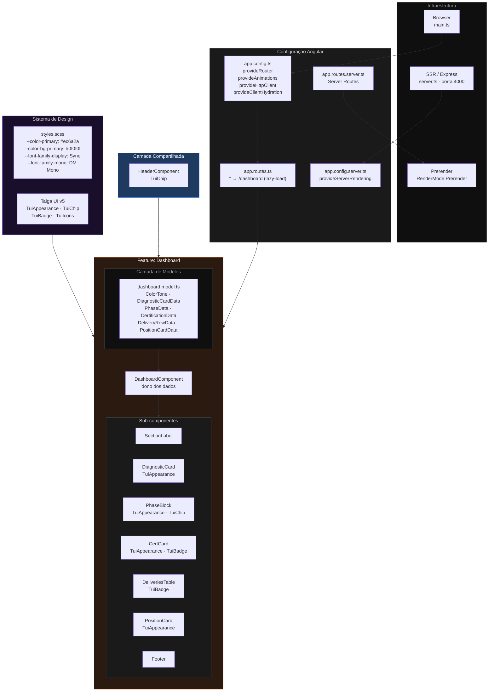
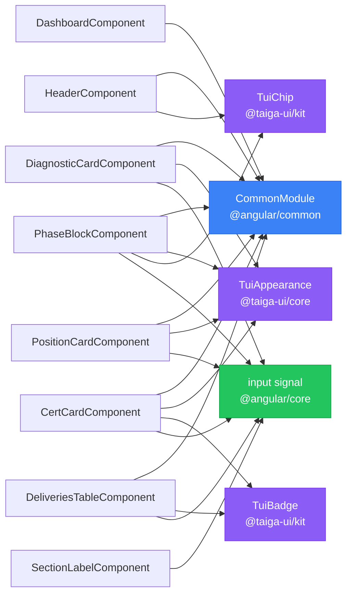

# PDI — Mapa de Componentes

> Angular 21 · Standalone Components · SSR (Express) · Taiga UI v5

---

## 1. Hierarquia de Componentes



---

## 2. Fluxo de Dados



---

## 3. Arquitetura Completa



---

## 4. Imports do Taiga UI por Componente



---

## 5. Estrutura de Arquivos

```
src/
├── main.ts                          ← entrada browser
├── main.server.ts                   ← entrada SSR
├── server.ts                        ← Express.js (porta 4000)
├── styles.scss                      ← design system / CSS vars
└── app/
    ├── app.ts                       ← componente raiz (RouterOutlet)
    ├── app.routes.ts                ← '' → /dashboard (lazy)
    ├── app.routes.server.ts         ← config prerender SSR
    ├── app.config.ts                ← providers (router, animations, HTTP)
    ├── app.config.server.ts         ← merge providers SSR
    │
    ├── shared/
    │   └── components/
    │       ├── index.ts             ← barrel export
    │       └── header/              ← HeaderComponent
    │
    └── features/
        └── dashboard/
            ├── dashboard.component.ts   ← página / dono dos dados
            ├── models/
            │   └── dashboard.model.ts  ← ColorTone + todas as interfaces
            └── components/
                ├── section-label/       ← @Input text
                ├── diagnostic-card/     ← @Input card: DiagnosticCardData
                ├── phase-block/         ← @Input phase: PhaseData
                ├── cert-card/           ← @Input cert: CertificationData
                ├── deliveries-table/    ← @Input rows: DeliveryRowData[]
                ├── position-card/       ← @Input card: PositionCardData
                └── footer/
```

---

## Resumo das Decisões de Design

| Aspecto | Decisão |
|---|---|
| Arquitetura | Standalone Components (sem NgModules) |
| Roteamento | Lazy-load da feature dashboard |
| Estado | Sem state manager — dados estáticos no `DashboardComponent` |
| API Angular | Input signals (`input.required<T>()`) em todos os filhos |
| UI Library | Taiga UI v5 (`TuiAppearance`, `TuiChip`, `TuiBadge`) |
| Renderização | SSR + Prerender via Angular Universal / Express |
| Design System | CSS Custom Properties centralizadas em `styles.scss` |
| Tipografia | Syne (display) + DM Mono (código) |
| Paleta base | Dark theme — `#0f0f0f` bg · `#ec6a2a` primary |
| Charts | `ngx-echarts` instalado, ainda não utilizado |
